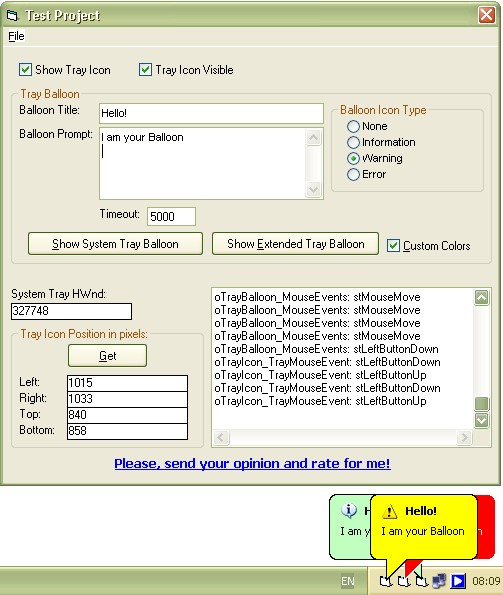



## An extended TrayIcon OCX with balloon tool tip even displaying on win 9x systems\.

### Description

Displays Tray Icon and two types of balloons.

The first one is the system provided by Shell_NotifyIcon function balloon.

The second one is actually a customisable Tool Tip control provided by "tooltips_class32" class. This balloon can be displayied on any Windows system since win 95 in opposite of "Shell_NotifyIcon" balloon. In addition it is possible to display several ballons in the same time for each application while the system balloon will not appears when any other application is already displaying its own balloon.

Also the TrayIcon control provides information about Tray Icon position on the screen.

Credits:

Nayan S. Patel: http://www.codeproject.com/Purgatory/Balloon-Tooltip.asp

Steve McMahon: http://www.vbaccelerator.com/home/VB/Code/Libraries/Subclassing/SSubTimer/article.asp

Arkadiy Olovyannikov: http://www.freevbcode.com/ShowCode.Asp?ID=3291 .

On some Win9x or NT systems you may need updated "MS Common Controls DLL". Download it from http://www.microsoft.com/downloads/details.aspx?displaylang=en&amp;FamilyID=6F94D31A-D1E0-4658-A566-93AF0D8D4A1E
 
### More Info
 

             |
---                |---
**Submitted On**   |2006-05-15 20:36:10
**By**             |[Anatoliy Avroniev](https://github.com/Planet-Source-Code/PSCIndex/blob/master/ByAuthor/anatoliy-avroniev.md)
**Level**          |Advanced
**User Rating**    |4.9 (74 globes from 15 users)
**Compatibility**  |VB 6\.0, VB Script, VBA MS Access, VBA MS Excel
**Category**       |[Custom Controls/ Forms/  Menus](https://github.com/Planet-Source-Code/PSCIndex/blob/master/ByCategory/custom-controls-forms-menus__1-4.md)
**World**          |[Visual Basic](https://github.com/Planet-Source-Code/PSCIndex/blob/master/ByWorld/visual-basic.md)
**Archive File**   |[An\_extende1994775172006\.zip](https://github.com/Planet-Source-Code/anatoliy-avroniev-an-extended-trayicon-ocx-with-balloon-tool-tip-even-displaying-on-win-9x__1-63280/archive/master.zip)

